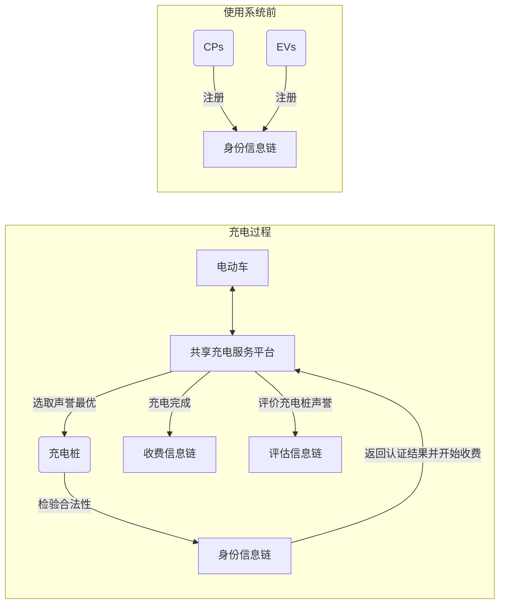

# 原文标题
A Cross-Chain Trusted Reputation Scheme for a Shared Charging Platform Based on Blockchain
发表于 IEEE 物联网期刊，第 9 卷，第 11 期，2022 年 6 月 1 日
[阅读链接](https://ieeexplore.ieee.org/abstract/document/9495937/?casa_token=XWkeFAyn7_gAAAAA:8PehYuLHIj20fWmrMj4iB6R_DMPbhqCcMgKV6UpHh_nIQPZnHj6QSq4GZDJxxPxYjd9gOIzXDrB9iw)
## 为啥选择看这篇文章
1. 与当前研究方向（跨域数据跨链解决方向）契合。
2. 选取顶会顶刊来看，IEEE Internet of Things Journal是SCI I区的。
3. 最近几年的文章
4. 页数（12页）不多，看起来不费劲

# 文章中名词解释
Electric Vehicle (EV)：电动车
Charging Pile (CP)：充电桩

# 摘要部分
电动汽车的快速发展使得充电桩不足的问题显露。
为了解决充电桩不足的问题，充电桩的运营商（国家电网）将私人充电桩纳入共享充电系统。
这面临两个问题
1. 由于加入共享收费的私人充电桩缺乏维护人员，使用者往往面临充电桩损坏和充电桩拥有者服务态度差的问题
2. 基于第三方平台的声誉解决方案面临单点故障的问题，基于区块链的声誉解决方案面临存储和查询效率的问题。

本文做了什么：
本文提出了一个多链收费模型，在不同的区块链上存储不同类型的信息
（用户认证、收费记录和评级信息，为了提高存储和查询效率）
本文提出了一种跨链可信的智能合同(C2T智能合同)。
（用于保证跨链信息的真实性、实时性和链间写互斥锁）

## 个人解读：
声誉其实我的理解就类似于推荐系统，给每个充电桩评定一个声誉，声誉好的价钱高的同时服务好。

# 引言部分
## 新能源汽车发展现状及前景
简单介绍了下国内外新能源汽车的保有量。以及未来新能源汽车的发展
根据相关研究数据得出，私营充电桩规模远胜公共充电桩，并且私人充电桩也更便宜，技术更成熟。
新能源汽车用户对充电体验满意度最低。
为了改善用户的充电体验，提出了一种声誉机制，该机制根据用户评分计算充电桩的声誉，这样高声誉CP更容易被用户选中，从而获得更多的收费奖励。
问题：
各大 CP 运营商推出的私有 CP 共享平台都采用第三方平台，信誉计算依赖于第
三方平台收集的用户评分信息。虽然这种方法是有效的，但是它很容易受到单点故障和集中欺骗的影响。
解决方案：
因此，提出了一种基于区块链的声誉机制，它记录了区块链上的声誉以防止篡改
为了获得准确的声誉，需要用户认证和收费记录来过滤虚假评级
为了提高存储和搜索信息的效率，我们提出了一个多链收费模型。
（用户认证、收费记录和评级信息）

## 现有跨链解决方案
简单介绍现有的跨链技术：
	1. 公正方案
	2. 侧链/中继
	3. 哈希锁定
然而，这些跨链技术的大多数应用程序都集中在资产转移上，而不是信息调用。

受跨链技术的启发，我们提出了一种跨链可信智能契约(C2T 智能契约) 
跨链思想的引入带来了以下三个重要挑战。
	1. 很难验证信息的真实性。
	2. 很难验证信息的实时性
	3. 计算的声誉可能与区块链中记录的信息不一致

C2T 智能契约，该契约部署在评价信息链上，可以调用身份信息链中的信息和收费信息链中的信息来计算声誉。该智能契约使用了数据互信机制、数据结构和哈希互斥体来
保证信息的安全性。
做出了以下贡献：
	1. 为了解决多链收费模型中信誉度的计算问题，我们设计了一个 C2T 智能契约来实现不同区块链之间的信息调用。
	2. 为了验证不同区块链之间调用信息的真实性，我们提出了一种基于 Merkle 证明的数据互信机制。在互信机制中，一方可以快速证明其他区块链上特定数据的真实性，而无需获得完整数据。
	3. 考虑到块大小限制问题，为了实现跨链信息的实时验证，我们提出了一种新的数据结构——VerRealTime，该结构由多个计数Bloom过滤器	(MCBFs)组成，可以保证跨链信息的实时性和节省空间。
	4. 为了确保信誉与区块链上的信息一致，本文使用了散列互斥锁定用于计算声誉的信息资源。在计算声誉之后，C2T 智能契约解锁锁定的信息，以确保强烈的声誉一致性。
	5. 我们从理论上分析了 C2T 智能合同的安全性。此外，我们还对消费进行了实验 C2T 智能合同的影响。

# 相关工作
介绍前人做的工作，与目前研究的工作的异同点。有无可借鉴的地方。
目前的跨链工作主要集中在资产交换和跨链沟通。
很少有研究，研究在信息交换过程中的真实性、实时性和互斥锁写互斥。

# 模型构造和设计要求
## 多链收费模型
### 名词解释
身份信息链 c1：负责存储数字证书及相关操作，例如电动车和保安员的创建和撤销; 
收费信息链 c2：负责存储收费信息;
评估信息链 c3：负责存储保安员的服务质量评级。

### 收费模型

在我们的收费模型中，有多个实体: 共享收费服务平台、CPs、 EVs 和多个链，如图所示。
共享收费服务平台负责 CPs，EVs 和多个链之间的交互。
充电完成后，可评估相应的指标，并将评级结果上载至评估报告信息链 C3。
充电完成后，充电交易会上传至充电信息链 C2。
多条信息链分别用于存储各类信息: 
由于每个区块链的记账员和应用场景是不同的，每个区块链可以采用适合自己的应用场景的共识机制。
虽然第三方平台也可以用来创建、存储和撤销数字证书，但它们很容易成为许多攻击的目标，如单点攻击、恶意 CA。因此，本文引入 c1 来消除中央 CA 的局限性，确保信息安全。

### 电动车充电流程

具体来说，在`CPs`和`EVs`进入系统之前，他们首先需要在`身份信息链`上注册。
然后，当电动汽车需要充电时，电动汽车应用到共享充电服务平台进行充电。
服务平台根据`CPs`的声誉选择最优的`CP`，并将需要认证的信息发送给`身份信息链`。
`身份信息链`不仅记录`CP`和`EV`的证书信息，还记录 用户注册、证书颁发、证书查询和证书撤销。
尽管新用户注册的可能性相对较小，但证书查询和证书撤销的操作需要经常更新。
验证后，结果返回到平台，然后平台授权对选定的`CPs`进行收费。
之后充电完成后，充电交易会上载至`收费信息链`。然后，充电电动车评估充电服务质量水平，并上传评级信息到`评估信息链`。
这里有一点值得注意: 在计算声誉的过程中，其他区块链的信息需要跨链调用。因此，我们设计了一个C2T智能契约，以确保真实性、实时性和链间写互斥锁的跨链信息。

## 威胁模型
在计算 CP 信誉的过程中，涉及到不同区块链的信息。
一般来说，有三种形式的跨链攻击。
1. 真实性攻击: 在C2T智能契约调用信息的过程中，对手会伪造或篡改信息，使得智能契约获得的跨链信息不真实。
2. 实时攻击: 在跨链调用信息的过程中，对手可能发出将区块链上的过时信息作为最新信息发送给C2T智能契约，导致计算相关信誉过期。
3. 互斥锁写入互斥攻击: C2T智能契约调用所需信息后，如果对手通过写入方式改变被调用的信息，最终计算的信誉与块链上的信息不匹配。
## 设计目标
1. 真实性:通过基于 Merkle 证明的数据互信机制，C2T智能契约可以快速地证明其他区块链上特定数据的真实性，而无需获取区块链上的所有数据。
2. 实时:块链可以在有限的块空间内记录最新的实时信息。特别是，当信息被跨链调用时，信息的实时性可以通过携带少量的验证信息来验证。
3. 互链写互斥锁:当C2T智能契约计算信誉时，被调用的信息需要被锁定。计算完成后，解锁。

# 跨链可信智能合同（C2T）
区块链基于协商一致机制和密码技术，建立了一套内部安全机制。跨链调度信息将突破区块链的内部安全边界，因为
区块链不参与其他区块链的共识过程。在共享计费模型中，涉及到不同区块链之间的信息，因此有必要重建一个安全机
制来保证跨链信息的安全性。因此，我们设计了一个 C2T 智能契约，以确保真实性、实时性和链间写互斥锁的跨链信息。

## C2T智能合同的过程
在计算声誉的过程中，涉及到多个链上信息的调用。为了确保跨链信息的真实性和可靠性，设计了一个 C2T 智能合同。具体过程如图 2 所示。

充电完成后，EVs 根据 CPs 的服务质量水平进行评分并签署 CPs。
记账员收集电动汽车在 CPs 上的评级，然后向评价信息链 c3 发送上传请求，以激活 C2T 智能合同。
为了防止CPs 和 EVs 的身份被伪造，C2T 智能合同将 CPs 和 EVs 的id 发送到身份信息链 c1 并请求它们的身份信息。
C1 接收到由共享计费服务平台签署的请求后，验证已签署的请求，并在区块链上搜索相关 CPs 和 EVs 的身份信息证书。查询的身份信息证书被发送到 C2T 智能合同进行验证。
如果 EV 和CP 的身份是真实的，C2T 智能合同将把 CP 的 ID 发送到收费信息链 C2。C2 会查询并将最新的充电信息返回给 C2T 智能合同。
在验证收费信息的真实性后，C2T 智能契约将收费信息上传到 C3，然后计算 CP 的信誉，并将计算的信誉存储在 c3 上，以便下次选择最优 CP。

## 跨链真实性方案
### 名词解释
C2T（CROSS-CHAIN TRUSTED）合约：跨链信任合约
Mv：在每个Cv(v ∈{1,2,3}上设置的一个用于证明数据真实性的证明模块。
Q = (ID, c) ：Q表示QueReq（查询请求）用于在区块链上进行Merkle树查询
q {Cj,Q}：CallReq(调用请求)，其中两个参数表示区块链Ci，查询请求Q。
α：表示授权标识符
Sig(q,α): 签名函数
ID:表示 EV 或 CP 的 ID
c:表示查询请求的具体内容(在Merkle树上对应的c位置)
MP：查询进程
Info In： 查询信息

由于区块链的可信环境只在区块链平台内生效，不能被其他区块链平台信任，因此需要引入额外的证明信息 p 来实现跨区块链平台的可信交互。因此，我们设计了一个基于Merkle证明的数据互信机制来验证跨链数据的真实性。
### 查询过程
当c3上的C2T智能契约向c1或c2发送调用请求CallReq = { Cj，q }(j ∈{1,2} ，q = (ID，c))时，
c3上的m3是对 q = (ID，c)进行签名操作得到 Sig (q，α)，将 q 和 Sig (q，α)发送到 Cj，由 Cj 上的 Mj 将验证合法性。
在认证通过后，q 中的查询请求 QueReq Q = (ID，c')被发送到区块链进行信息查询。
将信息查询的结果 Info In (ID，c)和 c 发送到查询进程 MP(Que Info In (ID，c)，MP返回 Merkle 证明
给 c3 上的 C2T 智能契约。
MP (Que Info In (ID，c))被用作额外的证明信息 p，以确保跨链数据的真实性。
以图 3 中c 的查询过程为例，如果您想验证c的真实性，MP(QueInfoIn (ID，c))只需要包括验证C 的路径，即 Hd、 Hab 和 Habcd。
Merkle树验证过程：略

## 跨链实时方案
Bloom 过滤器
一种实时方法是使用最新的块来存储实时信息列表，但该信息列表的存储空间将随着实时信息的增加而线性增加。
由于块的空间是有限的，Bloom 过滤器(BF)可以用来节省空间。
解释BF是啥？
介绍CBF
因为BF会用到多次哈希函数，耗时长！
为了减少多次哈希函数值转换所造成的运行时间，本文设计了一种数据结构VerRealTime 来解决这一问题。
在这个解决方案中，字符串只需要转换一次，然后使用多个 mod 函数来获取剩余的值，从而减少了多个 hash 函数值转换引起的运行时间。
具体来说，VerRealTime 使用 MCBFs 来表示一个多维集合的单属性域。MCBF 共同完成元素的表示，并判断一个
元素是否属于集合。换句话说，所有的 CBFs 都代表了信息的实时性。当执行实时验证时，VerRealTime 中的所有
CBFs 确定信息是否是一起的实时信息。跨链信息的实时验证原理如图 4 所示。

### 实时信息初始化
首先，初始化了一个包含 kcbfs 的数据结构 VerRealTime，其中所有元素都为零，存储在 kcbfs 中的内容分别对应于kmod 函数的映射结果。当块链上的实时信息 r 存储在 MCBF 中时，需要经过以下步骤: 首先对 r 进行哈希运算，通过哈希码函数获得相应的哈希值 hc。然后，选取 hc K 大素数的 Mod 函数的余数。Modi 获得的剩余 mi 被映射到对应于 CBFi 的相对位置，并且该位置的值增加一。将 r 中的所有元素按照上述步骤加入到 MCBF 中，最终生成可用于实时信息验证的 MCBF。

### 实时信息查询算法

### 实时信息更新算法

## 跨链写互斥锁方案
在计算声誉的过程中，如果更新了计算声誉的CP或EV的相关信息，则计算的声誉是非实时的。与 CP 和 EV 的信息不匹配，导致计算无效。
因此，我们使用哈希互斥锁来锁定计算信誉的区块链信息资源，实现链间写互斥。
与传统的互斥锁相比，哈希互斥锁使用随机数 sj 和 hash(sj) 来解锁和锁定信誉计算资源 ωγ ∈ (所有区块链上的资源)。具体的解锁和锁定资源过程如算法4所示。
C2T智能合约在验证身份和交易的过程中产生随机数s1和s2。 s1 和 s2 被存储和散列，h1 = hash(s1), h2 = hash(s2)。
然后，将散列值hj分别发送给Cj。然后身份资源ωid∈ID和计费资源ωch∈CH分别在收到h1和h2后锁定，收到s1和s2时解锁。
ID是C1的所有资源，CH是C2的所有资源。
锁定 ωγ 后，将其发送到 C2T 智能合同进行验证。在计算出信誉后，sj被发送给 Cj 以解锁 ωγ。
这个过程保证了链间写互斥。

# 安全性分析和实验评估
## 安全分析
为了解决信息的跨链安全问题，本文提出了一种C2T智能合约方案，实现信息的跨链交互。该方案由三种基本方法组成：1. Merkle证明算法实现真实性方案； 
2. 实现实时方案的VerRealTime数据结构；
3. 哈希互斥体实现链间写入互斥方案。
在本节中，我们列出一些证明来证明真实性方案可以抵抗真实性攻击，实时方案可以抵抗实时攻击，链间写互斥方案可以抵抗链间写互斥攻击。
综上所述，C2T智能合约在威胁模型中可以抵抗真实性攻击、实时攻击、链间写互斥攻击，达到安全目的。
1. 真实性攻击：C2T 智能合约调用其他区块链上的信息时，使用 Merkle 证明算法作为其基本算法来保证信息的真实性。基于Merkle证明的数据互信机制，使C2T智能合约无需获取区块全量数据，即可快速证明调用信息的真实性，(类似于比特币快速支付验证SPV)
2. 实时攻击：由 MCBF 组成的 VerRealTime 可以查询信息的实时性。当数据实时校验时，如果攻击者在调用信息的过程中将过期信息n作为实时信息r传递给C2T智能合约，则HashCode(n) = HashCode(r), Modi(HashCode(n ) = Modi(HashCode(r)) (1 ≤ i ≤ k). 数据结构找不到n的实时性，说明n是非实时信息。
3. 跨链写入互斥攻击：在跨链过程中，C2T智能合约使用哈希互斥锁来锁定和解锁ωγ，以保证多链共享数据操作的完整性。当在 Cj 上调用 ωγ 计算信誉时，C2T 智能合约将 hj 发送给 Cj 以锁定 ωγ 。如果攻击者想要修改 ωγ ，资源已经被锁定，无法访问。
## 实验评估
在这一部分中，我们得到了 C2T 智能合约的 gas 消耗以及 C2T 智能合约在该收费场景下威胁模型中对抗各种攻击的效果。
此外，我们还比较和分析了真实性方案中使用的 MCBF 与其他过滤器之间的区别。
同时，在跨链真实性方案中也测试了不同函数数量对误报率（FP）的影响。

C2T 智能合约的开销：C2T 智能合约涉及多条链之间的信息调用。我们在本地构建三个区块链：
1）身份信息链； 
2）计费信息链； 
3）评估信息链；
通过solidity编程语言编写智能合约。在 C2T 智能合约中，CP 的整个信誉计算过程包括跨链信息验证和信誉计算。跨链信息验证的重点主要是验证信息的真实性和实时性以及占用资源的不可篡改。因此，为了简单起见，我们直接将CP的声誉计算所需的信息保存到本地，由C2T智能合约调用。
### C2T 智能合约的开销：
我们将 C2T 智能合约部署到 Remix IDE 以测量其 gas 消耗。 C2T 智能合约的主要 gas 消耗如图5和6。
图5显示了跨链验证过程中的主要gas消耗。但是在验证信息的真实性时，区块信息的多少和在Merkle树中的位置对gas消耗有很大的影响。因此，我们在不同的 Merkle 树上验证不同位置信息的真实性，并记录 gas 消耗量。结果如图6所示。由于信息验证和信誉计算过程涉及大量交互，消耗大量gas，因此占据了智能合约的主要消耗。

### 跨链真实性方案评估：
在没有真实性验证的情况下，攻击者可能会发起两种真实性攻击：
1. 是CP运营商或私人桩主雇佣有偿拥护者对自己的CP进行刷评价，以提高自己CP的声誉值；
2. 是CP运营商在与其他运营商竞争时，雇佣付费支持者对CP进行恶意打分。（恶意竞争）
在这一部分，我们进行了两组实验。
1. 实验测试了当评级服从具有不同方差的正态分布时对声誉计算的影响。
2. 实验验证了 C2T 智能合约中的跨链真实性方案对两次真实性攻击的效果。
在第一组实验中，我们假设真实性方案验证后评分服从N(2, σ 2)；第一次攻击后评级服从 N(3, σ 2)；第二次攻击后评分服从 N(1, σ 2)。
第一组实验包括三个实验：
1）第一个实验测试不同方差的正态分布对高估评分声誉的影响；
2）第二个实验测试了不同方差的正态分布对正态评级声誉的影响； 
3）第三个实验测试了不同方差的正态分布对低估评级声誉的影响。
具体效果如图7所示。
观察这组实验的结果可以看出，正态分布的方差σ2对首次真实性攻击和正态评级的信誉计算几乎没有影响。对于第二次真实性攻击，波动幅度在可控范围内，趋势一致。

因此，在第二组实验中，我们假设真实性方案验证后评分服从 N(2, 0.6)，第一次真实性攻击后评分服从 N(3, 0.6)，评分服从 N( 1, 0.6) 在第二次真实性攻击之后。该组实验包括两个实验。第一个实验包括两个遭受第一次真实性攻击的 CP：一个 CP 的真实性已经过验证，另一个没有。效果对比如图8(a)所示。第二个实验包括两个遭受第二次真实性攻击的 CP：一个 CP 已通过真实性验证，另一个未通过真实性验证。效果对比如图8(b)所示。

### 跨链实时方案评估
在这一部分，我们首先比较一下MCBF、BF、CBF的区别。具体比较见表二。

BF中的位类型是bool类型，只存储0和1两个值。 BF为了不影响集合中已经存在的元素，只能添加元素不能删除，FP（false positive）率高。与BF相比，CBF中的bit类型为int类型，增加了删除操作，减少了FP。本文VerRealTime中使用的MCBF是由MCBF组成的。信息一次转换成值，然后用多个Mod取值的余数，可以减少hash函数转换带来的运行时间。
此外，在这种跨链实时方案中，实时信息的FPs与Mod函数的数量有关。我们将在MCBF中查询去重后的1亿条数据。最大可用内存为1G。实验结果如表 III 所示，其中显示了 Mod 函数的数量与 FP 率之间的关系。

### 跨链写入互斥方案评估
实验验证有效评分率δ为100%、80%、50%时链间写互斥的延迟时间。跨链写入互斥的延迟是C2T智能合约计算信誉时其他区块链的锁定时间，由信誉计算时间决定。信息跨链传输时，有效评分率表示参与信誉计算的传输信息的评分比例。
从图10可以看出，有效评级率越高，时延越大；反之亦然。

# 结论和未来的工作
为保证C3、C1、C2之间信息的准确传输，我们提出了C2T智能合约调用多个区块链上的信息并进行信誉计算。
特别地，我们提出了一种数据互信机制，该机制使用 Merkle 证明作为底层算法来确保信息的真实性。此外，我们提出了一种数据结构VerRealTime，以保证信息的实时性。为了保证信息的链间写入互斥，我们提出了一种利用哈希互斥锁锁定区块资源的算法。安全分析和实验结果表明，C2T 智能合约实际上是可行的。
本文提出的解决方案也有一定的局限性。不同区块链之间的交互太多，造成大量的资源消耗。因此，在未来的研究工作中，我们会在每条区块链上部署一个智能合约，负责其所在区块链的计算过程。计算完成后，我们只需要在部署在不同区块链的智能合约之间传递计算结果即可。这种改进节省了传输资源消耗。
# 个人感悟
文章好长，没我之前看的比特币简洁。
逻辑清晰，明确表明了现有的问题，自己的想法和解决方案。
关于`新能源汽车用户对充电体验满意度最低`部分在《2019年新能源汽车消费者市场调查报告》中找不到相关数据。
文章提出了个大致想法和一个智能合约，并尽可能的从多个角度来验证想法的可行性，文章中没有完整的实现。
## 疑问
C2T合约是部署到哪个区块链上的？